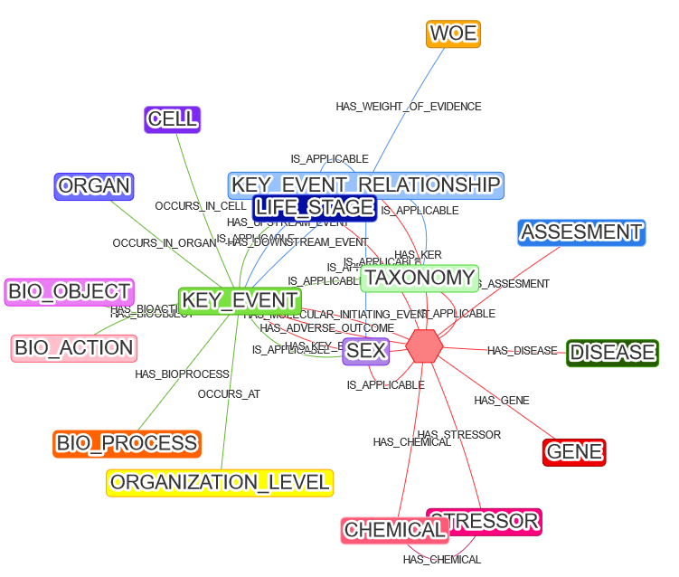

# AOPWIKI Explorer

AOPWiki Explorer is a Labeld property graph (LPG) adaptation of AOPwiki. LPG schema is adapted using neo4j graph database providing cypher and natural language based query engine to explore AOPs. Explorer provides intutive network visualization of AOPs component.AOPwiki Explorer is developed under project [**Partnership for the Assessment of Risks from Chemicals (PARC)**](https://www.eu-parc.eu)


## Requirements 🐳
- Docker  
- Docker-compose  

Follow the documentation [documentation](https://docs.docker.com/engine/install/), to install docker and docker compose

## Quick Installation

The recommended method to use AOPWIKI explorer is through Docker container.

### Step 1: Clone the Repository
Open the command prompt and write the following command
```shell
git clone https://github.com/Crispae/AOPWiki_Explorer.git
cd AOPWiki_Explorer
```  
### Step 2: Build Docker Container

In the [`docker-compose.yaml`](https://github.com/Crispae/AOPWiki_Explorer/blob/main/docker-compose.yaml) file, it's essential to update the `OPENAI_API_KEY` to enable the query translation service.

#### Instructions:

1. **Obtain Your OpenAI API Key:**
   - Get your OpenAI API key from the [OpenAI API page](https://openai.com/blog/openai-api).

2. **Update the `OPENAI_API_KEY`:**
   - Locate the `docker-compose.yaml` file in the cloned repository.
   - Replace the placeholder for `OPENAI_API_KEY` with your obtained API key.

3. **Build the Docker Container:**
   - After updating the OpenAI key, initiate the container build using the following command:
   ```shell
   docker compose up

### Step 3: Populate the Graph Database with AOP Information

To update the graph database with the latest AOP information, follow these steps. This process is a one-time setup.

#### Instructions:

1. **Open the Jupyter Notebook:**
   - Access the Jupyter Lab by clicking on the provided URL captured from the console while running the Docker instance. The URL will resemble: `http://127.0.0.1:8888/lab?token=your_token`

2. **Run the `GraphEnricher.ipynb` Notebook:**
   - After accessing the Jupyter Lab, locate and run the `GraphEnricher.ipynb` notebook within the interface.

3. **Updating the Database:**
   - If it's the first installation on your system:
     - Run the entire Jupyter Notebook. This process will update the database with the latest AOP information.

   - If it's an update to the existing installation:
     - Uncomment the relevant cells in the notebook to delete the information in the graph database before running the notebook. This step ensures that the database gets updated with the most recent information.

These steps are essential for maintaining an updated graph database containing the latest AOP information. Make sure to follow these instructions to keep the database current.


### Step 4. Acess the interface  
Open following link on your web browser to access the AOPwiki-Explorer  `http://127.0.0.1:3000/`

## Examples ✨  

### Understand schema   

Optimal utilization of AOPWiki Explorer involves familiarizing yourself with the network schema, comprehending the connections between nodes and edges, and understanding their respective nomenclature. To access the schema of the AOP network, execute the following command within the **Cypher query** editor:
```sql
call db.schema.visualization
``` 
<div style="align-content:center">
    
</div>

The above schema defines the standard names of **nodes** and their **relationship**, this will helps to formulate natural language transversal query over the graph.

### Mandatory input
Input in **textual query** area is mandatory, as it will allow to keep track of query in natural language form and also allow to translate the query, when user is not comfartable with **cypher query**. For translation query to active, `OPEN_AI_KEY` environment variabel must be passed while running `docker compose up`.

#### Usage
##### Direct cypher query

Query which are straight forward, according to shcema of AOP. Some examples such as:  

1. **Key events linked with AOP 450 ?**  
2. **stressors initiates the AOP 450 ?**  

These query can be asked as atural language query and can be translated to cypher query.  The cypher code of these query are:  


**Key events linked with AOP 450 ?**    
```sql
MATCH (a:AOP)-[r1:HAS_KEY_EVENT]-(b:KEY_EVENT)  
WHERE a.id = "450"  
RETURN *
```  

**Stressors initiates the AOP 450 ?**   
```sql
MATCH (a:AOP)-[r1:HAS_STRESSOR]-(b:STRESSOR)  
WHERE a.id = "450"  
RETURN *
```  

As you can see all, the above query is alinged with above AOP schema and queries ahev direct relation with the nodes.


2. Natural language query
3. Step wise query